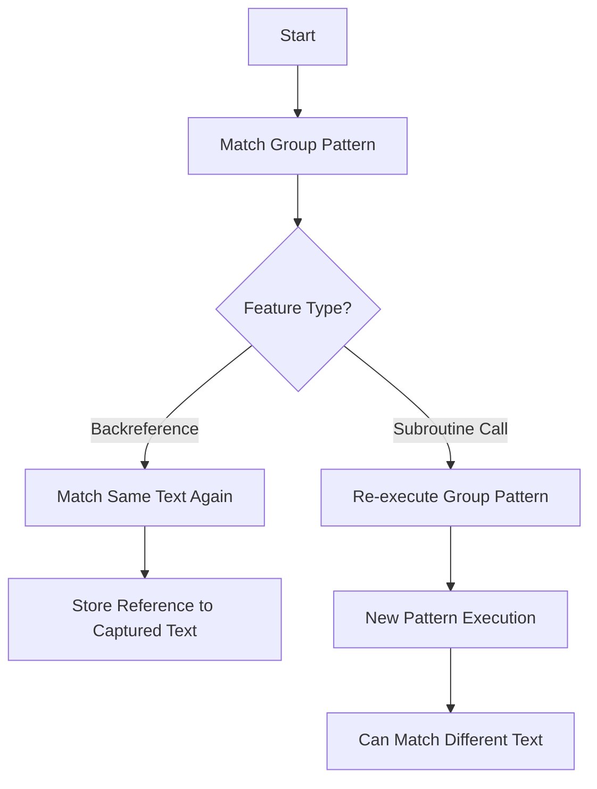
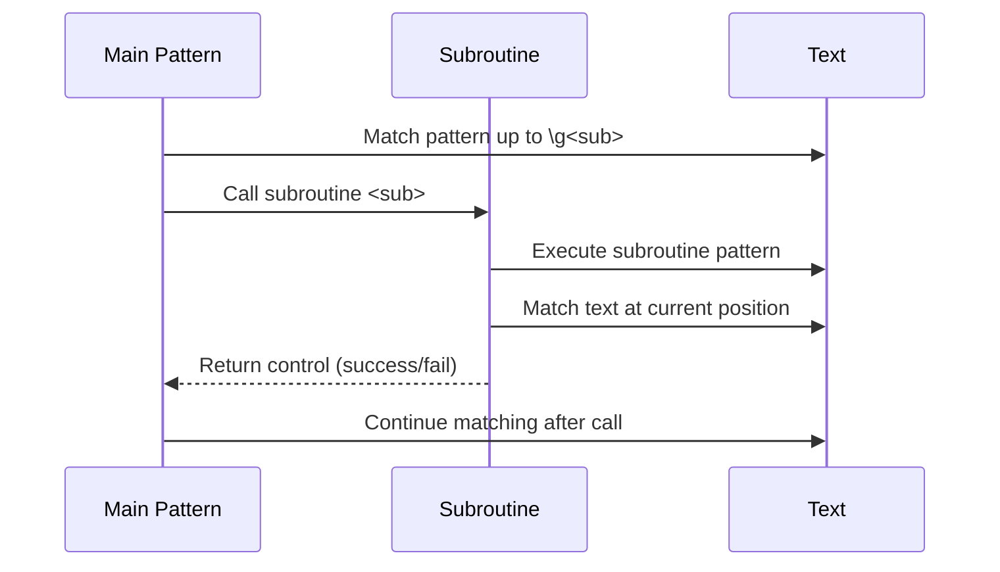
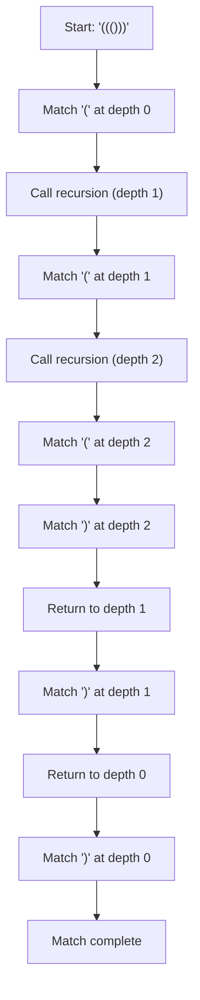
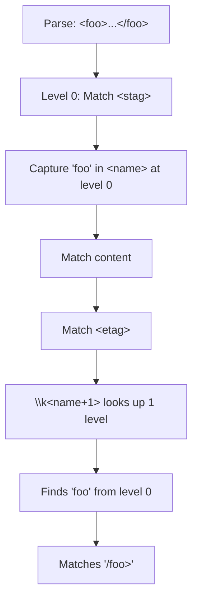

# Subroutine Calls and Recursion Level Backreferences in Oniguruma

## Table of Contents

1. [Introduction](#introduction)
2. [Basic Concepts](#basic-concepts)
3. [Subroutine Calls (`\g<...>`)](#subroutine-calls-g)
4. [Backreferences (`\k<...>`)](#backreferences-k)
5. [Recursion Level Backreferences](#recursion-level-backreferences)
6. [Capture Groups and Subroutine Calls](#capture-groups-and-subroutine-calls)
7. [Real-World Examples](#real-world-examples)
8. [Edge Cases and Limitations](#edge-cases-and-limitations)
9. [Implementation Guide](#implementation-guide)
10. [Reference](#reference)

---

## Introduction

Oniguruma is a powerful regular expression library that supports advanced features beyond traditional regex engines. Two of its most sophisticated features are:

1. **Subroutine Calls** (`\g<...>`): The ability to re-execute a subexpression within a pattern
2. **Recursion Level Backreferences** (`\k<name+level>`): The ability to reference captured text from a specific recursion depth

These features enable powerful pattern matching for recursive structures like balanced parentheses, nested XML/HTML tags, and mathematical expressions. This document explains how these features work and how they can be implemented in other regex engines.

**Target Audience**: Developers implementing regex engines in languages like Rust, without C/C++ experience, who need to understand the behavior and edge cases of these features.

---

## Basic Concepts

### Capture Groups

In regular expressions, parentheses `(...)` create capture groups that store the matched text:

```regex
(abc)       # Group 1 captures "abc"
(?<name>xyz) # Named group "name" captures "xyz"
```

### Backreferences vs. Subroutine Calls

These are fundamentally different operations:

- **Backreference** (`\k<name>` or `\1`): Matches the **same text** that was previously captured by a group
- **Subroutine Call** (`\g<name>`): **Re-executes** the pattern of a group, potentially matching different text

Example:
```regex
# Backreference
(abc)\1         # Matches "abcabc" (repeats the captured text)

# Subroutine call
(?<tag>abc)\g<tag>  # Matches "abcabc" OR "abcxyz" (re-executes the pattern)
```



---

## Subroutine Calls (`\g<...>`)

Subroutine calls allow you to re-execute a capturing group's pattern at a different position in the string. This is also known as "regex subroutines" or the "Tanaka Akira special" (named after the developer who contributed this feature).

### Syntax

```regex
\g<n>       # Call group n (n >= 1)
\g<0>       # Call the entire pattern (recursion)
\g<-n>      # Call the nth group backwards from current position
\g<+n>      # Call the nth group forwards from current position
\g<name>    # Call named group "name"
\g'name'    # Alternative syntax with single quotes
```

### How It Works

When the regex engine encounters `\g<name>`:
1. It saves the current matching state (position, captures, etc.)
2. Jumps to the pattern defined in the named group
3. Executes that pattern from the current position
4. Returns to continue with the rest of the pattern



### Basic Examples

#### Example 1: Simple Repetition

```regex
Pattern: (?<x>abc)\g<x>
Text: "abcabc"
Result: Match ✓

Execution:
1. (?<x>abc) matches "abc" at position 0-3
2. \g<x> calls the pattern 'abc' again
3. 'abc' matches at position 3-6
4. Full match: "abcabc"
```

#### Example 2: Different Text on Each Call

```regex
Pattern: (?<digit>\d+):\g<digit>
Text: "123:456"
Result: Match ✓

Execution:
1. (?<digit>\d+) matches "123" at position 0-3
2. ':' matches ':' at position 3-4
3. \g<digit> re-executes \d+
4. \d+ matches "456" at position 4-7
5. Group 'digit' now contains "456" (last capture)
```

### Recursion with `\g<0>`

The most powerful use of subroutine calls is recursion - calling the entire pattern from within itself.

#### Example 3: Balanced Parentheses

```regex
Pattern: \A(?<paren>\((?:\g<paren>|[^()])*\))\z
Text: "((()))"
Result: Match ✓

How it matches:
- Outer layer: \( matches '('
- Recursively match \g<paren> for inner content
  - Next layer: \( matches '('
    - Innermost: \( matches '(', ')' matches ')', returns
  - ')' matches ')', returns
- ')' matches ')'
```



---

## Backreferences (`\k<...>`)

Backreferences match the exact same text that was captured by a group earlier in the match.

### Syntax

```regex
\n          # Backreference group n (n >= 1)
\k<n>       # Alternative syntax for group n
\k<-n>      # Nth group counting backwards
\k<+n>      # Nth group counting forwards
\k<name>    # Backreference named group
\k'name'    # Alternative syntax with single quotes
```

### Basic Examples

#### Example 4: Simple Backreference

```regex
Pattern: (?<word>\w+) \k<word>
Text: "hello hello"
Result: Match ✓

Execution:
1. (?<word>\w+) captures "hello"
2. ' ' matches space
3. \k<word> matches "hello" again (same text)
```

#### Example 5: Multiple Named Groups

When multiple groups share the same name, backreference tries them in reverse order (most recent first):

```regex
Pattern: (?<x>a)|(?<x>b) \k<x>
Text: "b b"
Result: Match ✓

Execution:
1. First alternative fails to match 'b'
2. Second (?<x>b) captures "b"
3. \k<x> references the most recent 'x' group (second one)
4. Matches "b" again
```

---

## Recursion Level Backreferences

This is where things get interesting. Recursion level backreferences allow you to reference a capture from a specific recursion depth.

### Syntax

```regex
\k<name+level>  # Group at relative recursion level (deeper)
\k<name-level>  # Group at relative recursion level (shallower)
\k<n+level>     # Numbered group at relative level
\k<n-level>     # Numbered group at relative level
```

- `level` is a non-negative integer
- `+level` refers to a group at a **deeper** recursion level (parent → child direction)
- `-level` refers to a group at a **shallower** recursion level (child → parent direction)
- `+0` refers to the group at the **same** recursion level

### Understanding Recursion Levels

When using subroutine calls (especially `\g<0>` for recursion), the regex engine maintains a **call stack** where each recursive call has its own set of captured groups.

```
Level 0 (outermost):  (?<a>...) captures "X"
  Level 1:            (?<a>...) captures "Y"  
    Level 2:          (?<a>...) captures "Z"
```

Without recursion level syntax:
- `\k<a>` always references the **most recent** capture at **any level** (typically "Z" in above)

With recursion level syntax:
- `\k<a+0>` references capture "Z" (same level)
- `\k<a-1>` from level 2 references "Y" (one level up)
- `\k<a-2>` from level 2 references "X" (two levels up)

### Example 6: Same-Level Backreference

```regex
Pattern: \A(?<a>|.|(?:(?<b>.)\g<a>\k<b+0>))\z
Text: "reer"
Result: Match ✓

Explanation:
- The pattern matches palindromes
- At each recursion level, (?<b>.) captures one character
- \k<b+0> ensures we match the SAME character captured at THIS level
```

Let's trace through "reer":

```
Level 0: (?<a>...) called
  Match (?<b>.)    → captures 'r'
  \g<a>            → recurse to level 1
  
  Level 1: (?<a>...) called
    Match (?<b>.)  → captures 'e'
    \g<a>          → recurse to level 2
    
    Level 2: (?<a>...) called
      Match empty alternative (base case)
    Returns
    
    \k<b+0>        → matches 'e' (same level capture)
  Returns
  
  \k<b+0>          → matches 'r' (same level capture)
Returns

Result: "reer" matches!
```

### Example 7: Cross-Level Backreference

```regex
Pattern: (?<element> \g<stag> \g<content>* \g<etag> ){0}
         (?<stag> < \g<name> \s* > ){0}
         (?<name> [a-zA-Z_:]+ ){0}
         (?<content> [^<&]+ | \g<element> ){0}
         (?<etag> </ \k<name+1> > ){0}
         \g<element>

Text: "<foo>content</foo>"
```

In the closing tag `\g<etag>`, the expression `\k<name+1>` references the tag name from **one recursion level up** (the opening tag's name).



For nested tags:

```
Text: "<foo>text<bar>inner</bar>more</foo>"

Level 0: <foo>
  name = "foo"
  content:
    Level 1: <bar>
      name = "bar"
      <etag>: \k<name+1> = "bar" (from level 1)
    </bar>
  <etag>: \k<name+1> = "foo" (from level 0)  
</foo>
```

---

## Capture Groups and Subroutine Calls

Understanding how subroutine calls interact with capture groups is crucial for both using and implementing this feature.

### Capture Behavior

#### During Matching (Backreferences)

When a subroutine is called, it creates a **new scope** for captures:

```regex
Pattern: (?<x>a) (?<y>(?<x>b)\k<x>)
Text: "abb"

Execution:
1. First (?<x>a) captures "a"
2. Enter (?<y>...)
   - (?<x>b) captures "b" (overwrites previous 'x')
   - \k<x> references "b" (most recent 'x')
3. Full match succeeds
```

**Key points**:
- Captures are stored in a stack structure
- Backreferences see the most recent capture of a given name/number
- When a subroutine returns, its captures may persist or be discarded depending on context

#### After Matching (Programmatic Access)

After a successful match, the final capture values depend on which execution path completed:

```regex
Pattern: (?<tag>abc)|\g<tag>
Text: "abc"

After match:
- Group 'tag' contains "abc"
```

```regex
Pattern: (?<x>a)(?<x>b)\k<x>
Text: "abb"

After match:
- Group 'x' contains "b" (last successful capture)
```

### Multiple Named Groups

Oniguruma allows multiple groups to have the same name:

```regex
Pattern: (?<x>a)|(?<x>b)
```

Behavior:
- **Backreferences**: Try groups in reverse order (most recent definition first)
- **Subroutine calls**: Not allowed with duplicate names (compile error)

### Accessing Captures Programmatically

After a successful match, you can access captures by:

1. **Group number**: `region->beg[n]` and `region->end[n]`
2. **Group name**: Use `onig_name_to_backref_number()` to get the group number first

```c
// Example: Accessing captures in C
OnigRegion* region;
int group_num;

// Get capture by number
int start = region->beg[1];
int end = region->end[1];

// Get capture by name
group_num = onig_name_to_backref_number(
    reg, 
    (UChar*)"tag", 
    (UChar*)"tag" + 3, 
    region
);
if (group_num >= 0) {
    start = region->beg[group_num];
    end = region->end[group_num];
}
```

**Important**: The `OnigRegion` structure contains the final captured values after the match completes. Intermediate captures during recursive calls are not accessible programmatically - they only exist for backreferences during the matching process.

---

## Real-World Examples

### Example 8: Balanced Parentheses

Problem: Match strings with balanced parentheses.

```regex
Pattern: \A(?<paren>\((?:[^()]|\g<paren>)*\))\z

Examples:
✓ "()"
✓ "(())"
✓ "((()))"
✓ "(()())"
✗ "(()"
✗ ")("
```

How it works:
1. `\(` matches opening parenthesis
2. `(?:[^()]|\g<paren>)*` matches either:
   - Non-parenthesis characters `[^()]`
   - OR recursively matches nested balanced parentheses `\g<paren>`
3. `\)` matches closing parenthesis

### Example 9: Simple Palindrome

Problem: Match palindromes (strings that read the same forwards and backwards).

```regex
Pattern: \A(?<pal>.|.(?:\g<pal>)?.\z)
Text: "racecar"
Result: Match ✓
```

Better version with same-level backreference:

```regex
Pattern: \A(?<p>|.|(?<c>.)\g<p>\k<c+0>)\z

Examples:
✓ ""
✓ "a"
✓ "aa"
✓ "aba"
✓ "racecar"
✗ "abc"
```

Trace for "aba":
```
Level 0:
  (?<c>.) captures 'a'
  \g<p> recurses
    Level 1:
      (?<c>.) captures 'b'
      \g<p> recurses
        Level 2:
          Empty alternative matches
      \k<c+0> matches 'b'
  \k<c+0> matches 'a'
Match!
```

### Example 10: Nested XML/HTML Tags

Problem: Match properly nested XML tags where opening and closing tags must match.

```regex
Pattern (simplified):
(?<element> \g<stag> \g<content>* \g<etag> ){0}
(?<stag> < (?<name>\w+) > ){0}
(?<content> [^<]+ | \g<element> ){0}
(?<etag> </ \k<name+1> > ){0}
\g<element>

Examples:
✓ "<p>text</p>"
✓ "<div><p>nested</p></div>"
✗ "<p>text</div>"  (mismatched tags)
```

The key insight: `\k<name+1>` in the closing tag references the tag name from one recursion level up, ensuring opening and closing tags match.

### Example 11: Mathematical Expressions

Problem: Parse and validate arithmetic expressions with nested parentheses.

```regex
Pattern: (?<expr>\d+|(?<op>[+\-*/])|\((?:\g<expr>)*\))

Examples:
✓ "123"
✓ "1+2"
✓ "(1+2)*3"
✓ "((1+2)*(3-4))"
```

### Example 12: JSON-like Nested Structures

Problem: Match nested array structures.

```regex
Pattern: (?<array>\[(?:\g<value>,?)*\]){0}
         (?<value>\d+|\g<array>){0}
         \g<array>

Examples:
✓ "[]"
✓ "[1,2,3]"
✓ "[1,[2,3],4]"
✓ "[[1,2],[3,4]]"
```

---

## Edge Cases and Limitations

### 1. Left-Recursion is Prohibited

Oniguruma does NOT allow immediate left-recursion (where a pattern starts by calling itself):

```regex
# INVALID - will cause an error
(?<name>a|\g<name>b)

# VALID - recursion is not at the start
(?<name>a|b\g<name>c)
```

**Reason**: Left-recursion could cause infinite loops without consuming any input.

### 2. Duplicate Names and Subroutine Calls

```regex
# INVALID - compile error
(?<x>a)|(?<x>b)\g<x>

# VALID - backreferences work with duplicate names
(?<x>a)|(?<x>b)\k<x>
```

**Reason**: It's ambiguous which pattern to call when multiple groups share a name.

### 3. Call Stack Depth Limits

Recursive calls have a maximum depth limit to prevent stack overflow:

```c
// Default limits (can be configured)
#define DEFAULT_SUBEXP_CALL_MAX_NEST_LEVEL  20
#define DEFAULT_SUBEXP_CALL_LIMIT_IN_SEARCH 0  // unlimited calls
```

You can configure these with:
```c
onig_set_subexp_call_max_nest_level(int level);
onig_set_subexp_call_limit_in_search(unsigned long n);
```

### 4. Backreference to Undefined Group

```regex
Pattern: \k<undefined>
Behavior: Depends on ONIG_SYN_STRICT_CHECK_BACKREF flag
  - If set: Compile error
  - If not set: Treated as never matching
```

### 5. Recursion Level Out of Range

```regex
Pattern: (?<a>.)\k<a-5>  # Tries to reference 5 levels up
Text: "ab"
Behavior: If level doesn't exist, backreference fails (doesn't match)
```

### 6. Capture Groups in Quantifiers

```regex
Pattern: (?<x>.)+\k<x>
Text: "abc"

Behavior:
- (?<x>.)+ captures "a", then "b", then "c"
- Final capture of 'x' is "c"
- \k<x> tries to match "c", fails
Result: No match
```

Only the **last** iteration's capture is visible to backreferences.

### 7. Numbered vs. Named Groups

When named groups are present:
```regex
# May be invalid depending on ONIG_OPTION_CAPTURE_GROUP
(?<name>abc)\g<1>  # Numbered call forbidden
(?<name>abc)\g<name>  # Named call required
```

Set `ONIG_OPTION_CAPTURE_GROUP` to allow numbered calls when named groups exist.

### 8. Option Inheritance

Options from the called group are always active during the call:

```regex
Pattern: (?-i:\g<name>)(?i:(?<name>a)){0}
Text: "A"
Result: Match ✓

Explanation:
- Main pattern has case-sensitive mode (?-i:...)
- But \g<name> calls (?<name>a) which has (?i:...) flag
- So "A" matches due to case-insensitive flag in the called group
```

### 9. Zero-Width Assertions and Calls

```regex
Pattern: (?=(?<x>a))\g<x>
Text: "a"
Result: Match ✓

Explanation:
- Lookahead (?=...) matches but doesn't consume
- (?<x>a) captures "a"
- \g<x> consumes "a" from the same position
```

### 10. Atomic Groups and Backtracking

```regex
Pattern: (?<x>(?>a+))\g<x>
Text: "aaaa"

Behavior:
- First call: (?>a+) captures all "aaaa" atomically
- \g<x> tries to match but no input left
- Atomic group prevents backtracking
Result: No match
```

---

## Implementation Guide

This section provides guidance for implementing subroutine calls and recursion level backreferences in another regex engine.

### Data Structures

#### 1. Call Stack

You need a stack to track recursive calls:

```rust
struct CallFrame {
    group_id: usize,           // Which group was called
    return_position: usize,    // Where to return in the pattern
    captures: Vec<CaptureSlot>, // Local captures for this frame
    recursion_level: usize,    // Current nesting depth
}

struct CallStack {
    frames: Vec<CallFrame>,
    max_depth: usize,          // Limit recursion depth
}
```

#### 2. Capture Storage

Captures need to be organized by recursion level:

```rust
struct CaptureSlot {
    start: usize,
    end: usize,
    group_id: usize,
}

struct CaptureStack {
    // Map: (group_id, recursion_level) -> CaptureSlot
    captures: HashMap<(usize, usize), CaptureSlot>,
    current_level: usize,
}
```

### Algorithm: Subroutine Call

```rust
fn execute_subroutine_call(
    group_id: usize,
    position: usize,
    call_stack: &mut CallStack,
    capture_stack: &mut CaptureStack,
) -> Result<usize, Error> {
    // 1. Check recursion depth
    if call_stack.frames.len() >= call_stack.max_depth {
        return Err(Error::MaxRecursionDepthExceeded);
    }
    
    // 2. Push new frame
    let frame = CallFrame {
        group_id,
        return_position: position,
        captures: Vec::new(),
        recursion_level: capture_stack.current_level + 1,
    };
    call_stack.frames.push(frame);
    capture_stack.current_level += 1;
    
    // 3. Execute the group's pattern
    let pattern = get_group_pattern(group_id);
    let result = match_pattern(pattern, position);
    
    // 4. Pop frame
    call_stack.frames.pop();
    capture_stack.current_level -= 1;
    
    // 5. Return new position or error
    result
}
```

### Algorithm: Recursion Level Backreference

```rust
fn resolve_backref_with_level(
    group_id: usize,
    level_offset: isize,  // +0, +1, -1, etc.
    current_level: usize,
    capture_stack: &CaptureStack,
) -> Option<&str> {
    // Calculate target level
    let target_level = if level_offset >= 0 {
        // Positive offset: go to parent level
        if current_level < level_offset as usize {
            return None; // Level doesn't exist
        }
        current_level - (level_offset as usize)
    } else {
        // Negative offset: go to child level
        current_level + ((-level_offset) as usize)
    };
    
    // Look up capture at target level
    capture_stack.captures
        .get(&(group_id, target_level))
        .map(|slot| &text[slot.start..slot.end])
}
```

### Parsing Considerations

1. **Distinguish calls from backreferences**:
   - `\g<name>` is a call
   - `\k<name>` is a backreference
   - Parse the backslash escape sequences carefully

2. **Parse level syntax**:
   ```rust
   // Pattern: \k<name+3> or \k<name-2>
   enum BackrefLevel {
       Current,              // \k<name>
       Relative(isize),      // \k<name+3> or \k<name-2>
   }
   ```

3. **Validate calls**:
   - Check for left-recursion during compilation
   - Ensure referenced groups exist
   - Disallow calls to duplicate-named groups

### Optimization Tips

1. **Memoization**: Cache results of subroutine calls for the same (group, position) pair to avoid redundant work

2. **Tail call optimization**: When a subroutine call is the last operation in a group, optimize as a tail call rather than pushing a frame

3. **Capture pruning**: Discard captures from failed branches early to reduce memory usage

4. **Level limit checks**: Check recursion depth before pushing frames, not during execution

### Testing Strategy

Implement test cases covering:

1. **Basic subroutine calls**: Simple calls and returns
2. **Recursion**: Self-referential patterns with various depths
3. **Captures during recursion**: Verify capture behavior at each level
4. **Same-level backreferences**: `\k<name+0>` patterns
5. **Cross-level backreferences**: `\k<name+1>` and `\k<name-1>`
6. **Error cases**: Max depth, invalid levels, left-recursion
7. **Real-world patterns**: Palindromes, balanced parentheses, nested tags

---

## Reference

### Syntax Summary

| Syntax | Description |
|--------|-------------|
| `\g<n>` | Call group n (n ≥ 1) |
| `\g<0>` | Call entire pattern (recursion) |
| `\g<-n>` | Call nth group counting backwards |
| `\g<+n>` | Call nth group counting forwards |
| `\g<name>` | Call named group |
| `\k<n>` | Backreference to group n |
| `\k<-n>` | Backreference to nth group counting backwards |
| `\k<+n>` | Backreference to nth group counting forwards |
| `\k<name>` | Backreference to named group |
| `\k<name+level>` | Backreference at relative recursion level (up) |
| `\k<name-level>` | Backreference at relative recursion level (down) |
| `\k<n+level>` | Numbered backref at relative level |

### Configuration Constants

```c
// Maximum recursion depth (default: 20)
DEFAULT_SUBEXP_CALL_MAX_NEST_LEVEL = 20

// Maximum number of subroutine calls during search (default: unlimited)
DEFAULT_SUBEXP_CALL_LIMIT_IN_SEARCH = 0
```

### API Functions

```c
// Get/Set recursion limits
int onig_get_subexp_call_max_nest_level(void);
int onig_set_subexp_call_max_nest_level(int level);

unsigned long onig_get_subexp_call_limit_in_search(void);
int onig_set_subexp_call_limit_in_search(unsigned long n);

// Access captures by name
int onig_name_to_backref_number(
    regex_t* reg,
    const UChar* name,
    const UChar* name_end,
    OnigRegion* region
);
```

### Error Codes

```c
ONIGERR_SUBEXP_CALL_LIMIT_IN_SEARCH_OVER  // Too many calls during search
```

### Constraints

1. **Left-recursion prohibited**: Pattern cannot start with a call to itself
2. **Duplicate names**: Cannot call groups with duplicate names
3. **Recursion depth**: Limited by `SUBEXP_CALL_MAX_NEST_LEVEL`
4. **Call count**: Limited by `SUBEXP_CALL_LIMIT_IN_SEARCH` during search

---

## Conclusion

Subroutine calls and recursion level backreferences are powerful features that enable pattern matching for recursive structures. Key takeaways:

1. **Subroutine calls** (`\g<...>`) re-execute a pattern, while **backreferences** (`\k<...>`) match captured text
2. **Recursion level backreferences** allow referencing captures at specific nesting depths
3. Implementation requires a **call stack** and **level-indexed capture storage**
4. Watch out for **left-recursion**, **recursion depth limits**, and **duplicate names**

For more information, see:
- [doc/RE](RE) - Full Oniguruma regular expression syntax
- [doc/API](API) - Oniguruma C API reference
- [test/test_utf8.c](../test/test_utf8.c) - Comprehensive test cases

---

**Document Version**: 1.0  
**Last Updated**: 2025-11-08  
**Oniguruma Version**: 6.9.10
